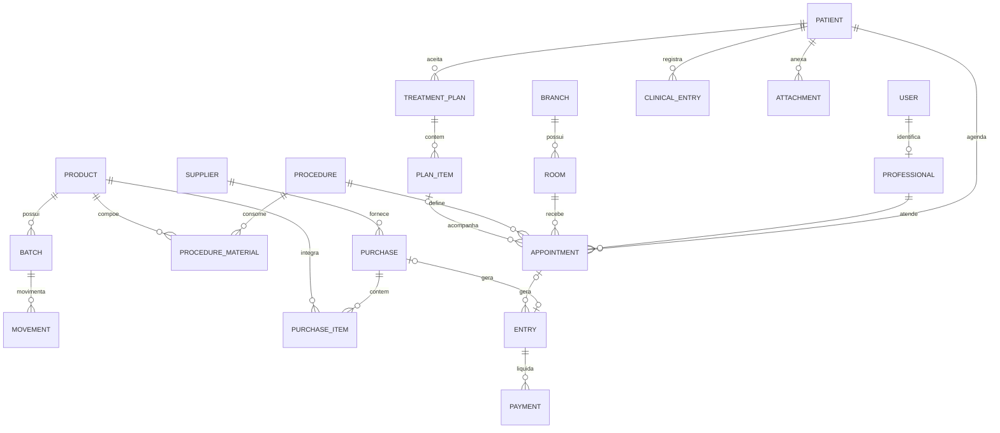

# Arquitetura e dados

Django 5.2 LTS, Python 3.12+, PostgreSQL para operação e SQLite para demonstração. Bootstrap, Chart.js, FullCalendar, Luxon e Lucide são distribuídos localmente, sem requisições a CDN durante o uso. As telas usam templates Django e JavaScript simples, sem etapa npm.

## Relações principais

## Transações

As rotinas em `services.py` aplicam transações e travas de domínio no PostgreSQL. Consultas usam trava de agenda; conclusão adquire estoque e depois financeiro. Recebimento adquire compras, estoque e financeiro. Isso serializa alterações conflitantes e mantém estoque, títulos e status consistentes. SQLite é para uso local de demonstração, sem garantia equivalente de concorrência.

Consulta concluída gera uma receita e, quando aplicável, uma comissão; baixa materiais por FEFO, desconsiderando lotes vencidos. A falta de qualquer material desfaz toda a conclusão. Repetir a conclusão ou o recebimento de compra não duplica lançamentos.

As páginas exigem permissões no servidor. Dentista visualiza sua agenda e seus planos; prontuário de pacientes é compartilhado entre profissionais clínicos autorizados. Recepção não acessa conteúdo clínico, anexos clínicos, despesas ou relatórios financeiros. Financeiro acessa comprovantes, sem prontuários.

## Proteção

Campos clínicos e arquivos são criptografados com Fernet. Cadastros administrativos não são criptografados por campo: proteja discos, banco, servidor e backups. Sem a chave original não há recuperação dos campos e anexos. `SECRET_KEY` e `FIELD_ENCRYPTION_KEY` nunca entram no repositório ou ZIP.

Registros clínicos, movimentações, pagamentos e auditoria são preservados pelas operações da aplicação. Retificações e estornos criam novos registros. O hash do registro clínico identifica seu conteúdo; não constitui assinatura digital certificada nem proteção contra administrador com acesso direto ao banco. A trilha registra usuário, ação e nomes dos campos, sem copiar o conteúdo clínico para logs.

Nenhum arquivo privado tem URL pública. Downloads verificam o perfil. Uploads aceitam somente PDF, JPEG e PNG até 10 MB; PDF tem validação de cabeçalho, não antivírus. A clínica deve definir controles de infraestrutura, retenção e varredura adequados à sua operação.
